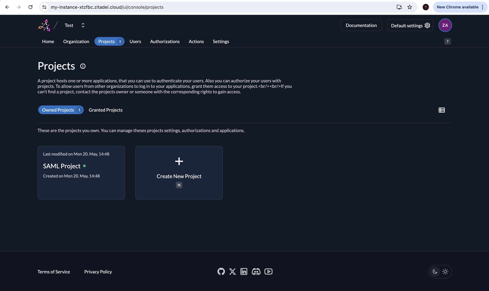

# A SAML Service Provider with ZITADEL Integration

This repository provides a simple SAML Service Provider (SP) setup to interact with ZITADEL as the Identity Provider (IdP). The application is built using Flask and the `pysaml2` library.

## Overview

We will be testing out the SP-Initiated SAML Flow:

1. The user attempts to access a resource at the SP.
2. The SP redirects the user to the IdP for authentication.
3. The user authenticates at the IdP.
4. The IdP sends a SAML response back to the SP.
5. The SP processes the SAML response and grants the user access.
6. The user logs out and sends a SAML request to the SLO endpoint and receives a SAML response.

## Prerequisites

- Python 3.x
- Flask
- pysaml2
- Flask-CORS
- xmltodict
- cryptography
- lxml

## Setting Up

1. **Clone the Repository**
    ```sh
    git clone https://github.com/zitadel/python-saml-sp.git
    cd python-saml-sp
    ```

2. **Install Dependencies**
    Make sure you have Python 3 installed. Then, create a virtual environment and install the required packages.
    ```sh
    python3 -m venv venv
    source venv/bin/activate
    pip3 install -r requirements.txt
    ```

3. **ZITADEL Configuration**
    You need to create a SAML app in your ZITADEL instance and upload the `sp_metadata.xml` file found in this repository. Follow these steps:
    - Log in to your ZITADEL instance.
    - Go to Projects and select your Project or create a new Project.
      
    - Create a new SAML Application.
      
    - Upload the `sp_metadata.xml` file.
    - Obtain the IdP metadata URL file (`https://[your-ZITADEL-domain]/saml/v2/metadata`) from ZITADEL and replace the content of `idp_metadata.xml` with the provided IdP metadata.

4. **Configuration**
    Ensure the paths in the `app.py` file for `key_file`, `cert_file`, and `xmlsec_binary` are correct.

## Running the Application

1. **Set Environment Variables**
    ```sh
    export FLASK_APP=app.py
    export FLASK_ENV=development
    ```

2. **Run the Application**
    ```sh
    flask run
    ```
    The application should now be running on `http://127.0.0.1:5000`.

## Endpoints

- `/` - Home page with options to generate a SAML request and perform SSO.
- `/generate_saml_request` - Endpoint to generate the SAML request.
- `/sso` - Endpoint to redirect to the IdP with the SAML request.
- `/acs` - Assertion Consumer Service endpoint to handle the SAML response from the IdP.
- `/logout` - Endpoint to initiate logout.
- `/slo` - Endpoint to handle Single Logout (SLO) response from the IdP.

## Files

- **templates/index.html** - HTML template for the home page.
- **templates/response.html** - HTML template to display the SAML response and user information.
- **app.py** - Main application file.
- **config.json** - Configuration file for the SAML SP.
- **idp_metadata.xml** - IdP metadata file (you must replace this with your own from ZITADEL).
- **sp_metadata.xml** - SP metadata file to be uploaded to ZITADEL.
- **requirements.txt** - List of Python dependencies needed to run the application.
- **sp-cert.pem** - SP certificate file.
- **sp-csr.pem** - SP certificate signing request file.
- **sp-key.pem** - SP private key file.

## Notes

- Keep the `sp-key.pem` file secure and do not share it publicly.

## Generating Your Own sp-key.pem and sp-cert.pem

If you want to generate your own `sp-key.pem` and `sp-cert.pem` files, you can use the following OpenSSL commands:

1. **Generate the private key:**
    ```sh
    openssl genpkey -algorithm RSA -out sp-key.pem -aes256
    ```

2. **Generate the certificate signing request (CSR):**
    ```sh
    openssl req -new -key sp-key.pem -out sp-csr.pem
    ```

3. **Generate the self-signed certificate:**
    ```sh
    openssl req -x509 -key sp-key.pem -in sp-csr.pem -out sp-cert.pem -days 365
    ```
    Replace `-days 365` with the desired validity period for the certificate.

## License

This project is licensed under the MIT License - see the [LICENSE](LICENSE) file for details.

## Acknowledgements

- [Flask](https://flask.palletsprojects.com/)
- [pysaml2](https://pysaml2.readthedocs.io/)
- [ZITADEL](https://zitadel.com/)


